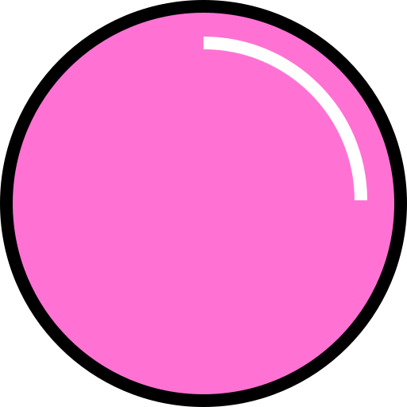

  

   

The _metarepo_ is a single repository that consists of many packages and various monorepos, a new concept that we are trying out to simplify the development process. Many of the projects presented here are dependencies of each other, so we can iterate in all at the same time and benefit from using [Yarn Workspaces](https://classic.yarnpkg.com/en/docs/workspaces/).

Check the individual documentations for more details:

* [@bubble-dev](packages/bubble-dev): Start preset and various shared configs to develop, test, build and publish packages in this metarepo
* [colorido](packages/colorido): set of helpers and types to work with RGBA colors as `[number, number, number, number]` tuples
* [elegir](packages/elegir): switch-like expressions that look good
* [@fantasy-color](packages/fantasy-color): color manipulation functions
* [@primitives](packages/primitives): set of universal React/React Native base components
* [@sandbox](packages/sandbox): React sandbox to show off components with all possible props and children combinations using [autoprops](packages/autoprops)
* [stili](packages/stili): universal React/React Native styles normalizer
* [@themeables](packages/themeables): themeable UI primitive set for building universal React/React Native design systems
